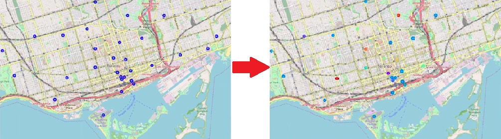

# Coursera_Capstone
 The Coursera Applied Data Science Capstone Project: The Battle of the Neighborhoods
 by: Diardano Raihan
 

## Case Study: The Battle of the Neighborhoods

Assume you currently live on the West side of the City of Toronto in Canada. You really love so much about its neighborhood simply because of all the great amenities and other types of venues that exist in the neighborhood.

Now you receive a job offer from a great company on the other side of the city with great career prospects. However, given the far distance from your current place, you unfortunately must move if you decide to accept the offer. 

__Wouldn't it be great if you're able to determine neighborhoods on the other side of the city that are exactly the same as your current neighborhood, and if not, perhaps similar neighborhoods that are at least closer to your new job.__

So in this capstone project, we will need to be creative and come up with our own idea or problem to solve using location data. For example:
- We can choose to compare different neighborhoods in terms of a service. 
- Search for potential explanation of why a neighborhood is popular. 
- The cause of complaints in another neighborhood, or 
- anything else related to neighborhoods. 

Hence the name of the capstone project will be __the Battle of the Neighborhoods__.

___City Segmentation and Clustering___

So what we need to do is, given a city like the City of Toronto, we will __segment it into different neighborhoods using the geographical coordinates__ of the center of each neighborhood. And then, using a combination of location data and machine learning, we will group the neighborhoods into clusters like this.

## Web Scraping: Toronto Postal Codes

We will start the project by scraping the following Wikipedia page.
https://en.wikipedia.org/wiki/List_of_postal_codes_of_Canada:_M

Objective:
- Obtain the data inside the html page containing a list of Toronto postal codes in the form of table and transform the data into a pandas dataframe!

You can see the process in `Pre1_Web_Scraping.ipynb`

## Coordinate Retrieval: Toronto Postal Codes

Objective:
- Now, we will get the latitude and the longitude coordinates of each neighborhood in order to utilize the Foursquare location data later in the separate main project notebook.

You can see the process in `Pre2_Coordinate_Retrieval.ipynb`

## Segment & Cluster Toronto Neighborhoods

Objective:
- Now, we will __explore__, __segment__, and __group neighborhoods__ into clusters to find similar neighborhoods in __Toronto City__.

You can see the process in `Pre3_Clustering_Neigborhoods_Toronto.ipynb`